# **DARK DATA** - Insights from Camera feed


### This project helps to utilize the dark data which every organization saves but never utilizes to extract the insights.

To begin the analysis we first install the libraries necessary to access AWS in the local machine.

We install boto3, AWScli and AWS using the command prompt using pip package.

Commands used : 

```
pip3 install awscli --upgrade --user
pip install boto3
pip install aws
```

IAM (Identity Access Management) account is created. While creating this IAM account for a user we give S3 access and AWS Rekognition access to the user. During creating IAM account, a pair of access key and access ID is generated. We save this Access key and access ID. After this step we create a bucket in S3. In this bucket a folder is created to store the images. 

To be able to access AWS account through our local machine, we run the command prompt and run 

```
aws2 configure
```

command and provide access key, access id, region and format during the setup. 

Once we complete these steps in Command prompt, open jupyter notebook and by using the stored video in the local system, frames are generated from the video. These frames are then stored in the S3 bucket and AWS Rekognition is used to analyze the headcount and emotions of the human beings. All these steps occur automatically using python script.

### Dark Data

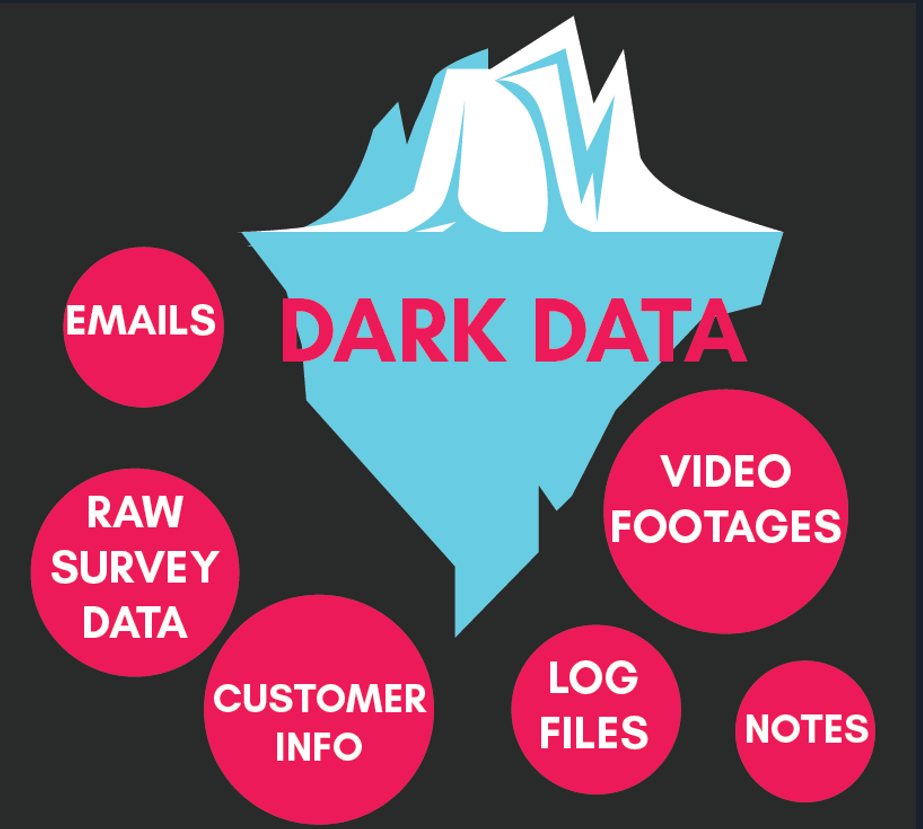

*Image courtesy:* *https://www.m-files.com/blog/sink-swim-managing-growing-flood-dark-data-eim/*

Around 65% of the data is dark data and out of this majority of it comprises Video footages. It is this data which is not utilized for getting insights. Through our project we help to develop actionable insights.


## How the video logs were processed ?

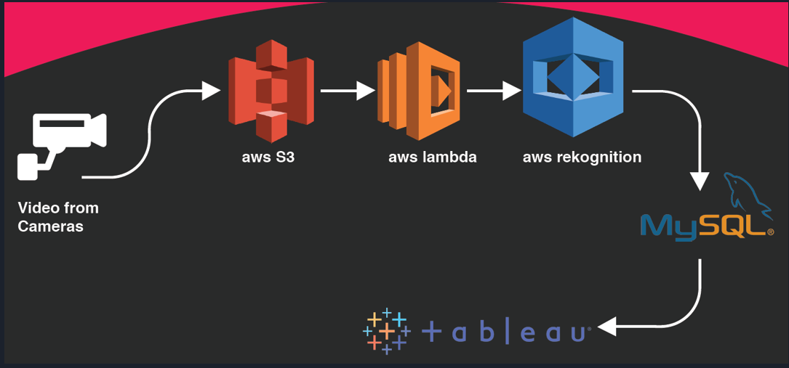

*AWS services used: S3, Rekognition*

**INPUT** -

Pilot:  Sample video feeds 

Production:  Live video feeds

**OUTPUT** -

Rekognition: Locations of objects in the frame & if applicable, their sentiments

MySQL: Rekognition output is transformed and stored in MySQL for feeding visualization software a structured dataframe.

Tableau: Visualizations

#### System Architecture explained below-

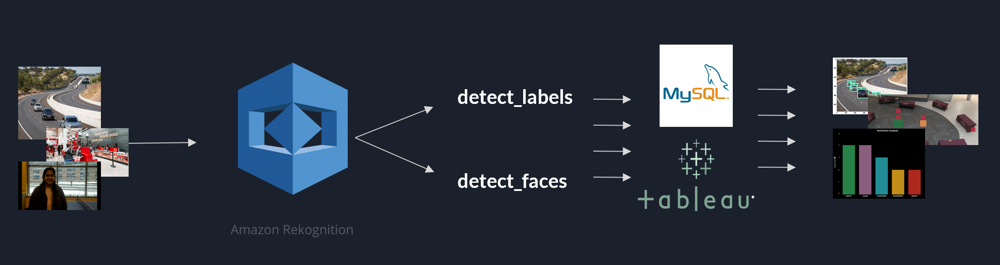


Snippets from a video showing different expressions (Video Courtesy: Darshika Sharma)

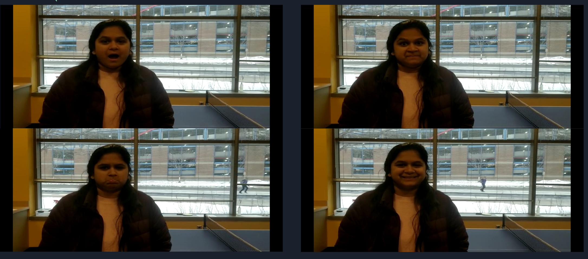

Based on the video overall Sentiment analysis result.

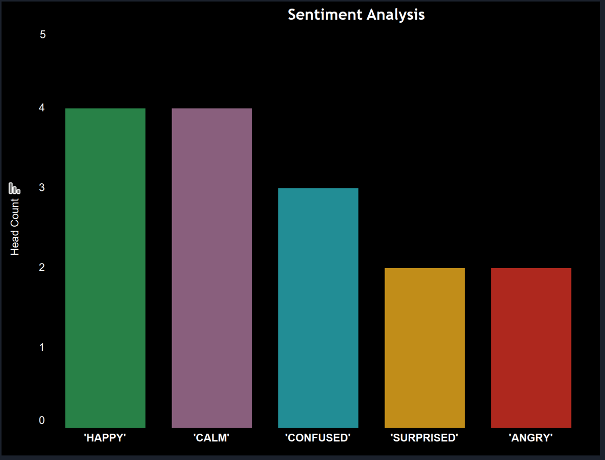


### Footfall Analysis - Heatmap Creation

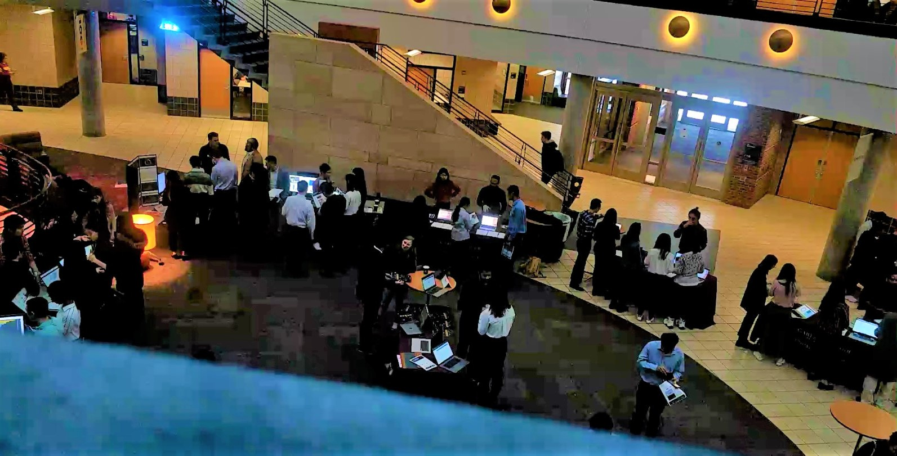

*The above image was the snippet from the live video captured during our trends market place presentation.*


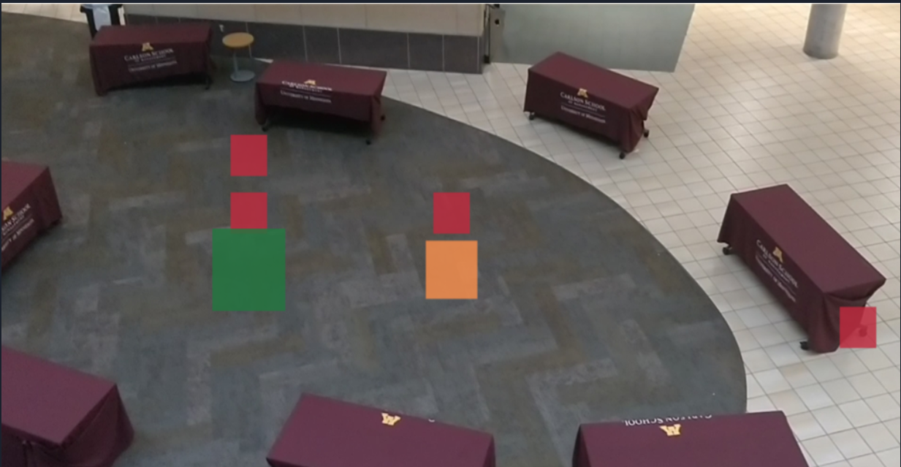

*This image is the footfall video analysis. The Carlson School's atrium was divided into 8 segments and the real-time heat map was generated to analyze which projects were most popular. It also helps to analyze how the traffic moved during the entire presentation time.*


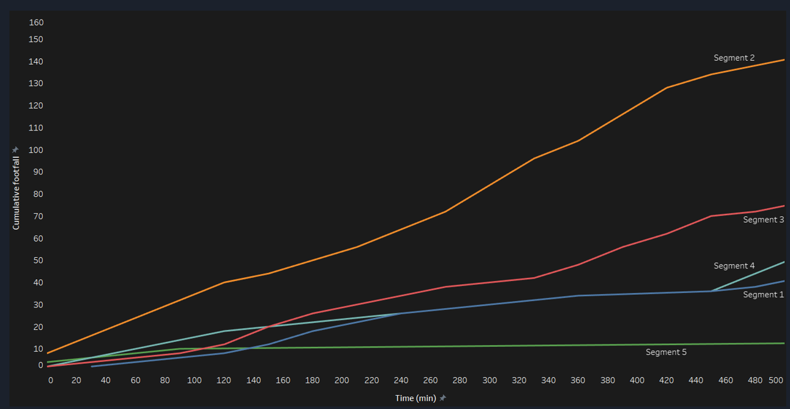

*Here we show a cumulative population that was in the defined section(s) of the atrium, here denoted as segments.*

### Other use cases

Other than feedback channel, retail can use it to solve problem of queues based on density.

###### **AI traffic control:** Extending the above use case, traffic lights durations can be extended or reduced based on the traffic density.

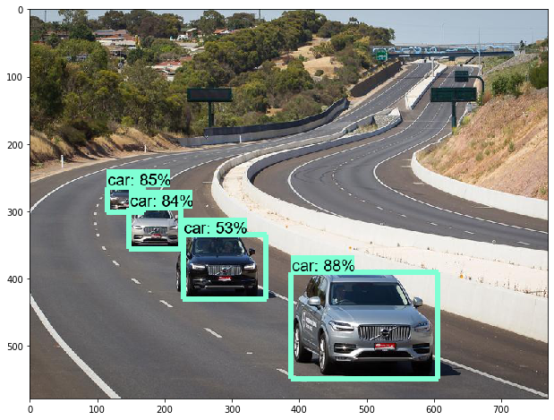

*Traffic Analysis for automated traffic control.*


###### Another use case, for academic purpose, would be to check the involvement of students in a class.

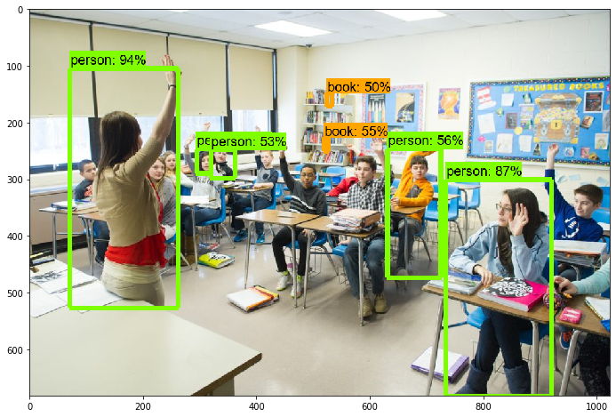

*Attendance of students in class*

###### Our project can also help a retail outlet identify sections on the floor that have high footfall which in turn helps them with product placements and better staff allocation.

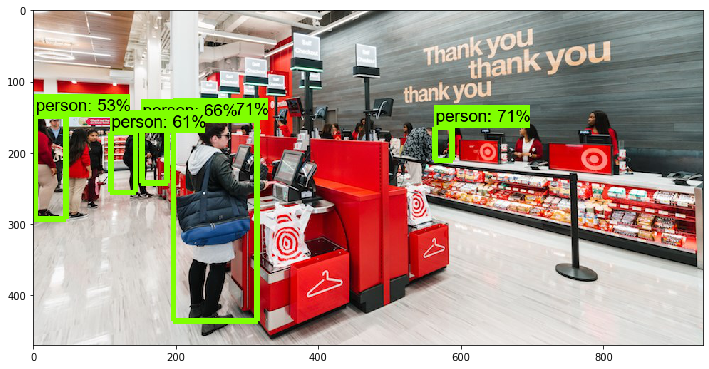

*Better management of self-checkout queues. Based on congestion on different check-out points.*

